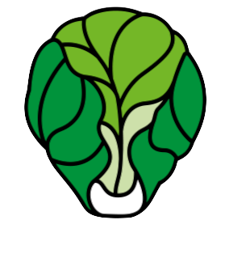
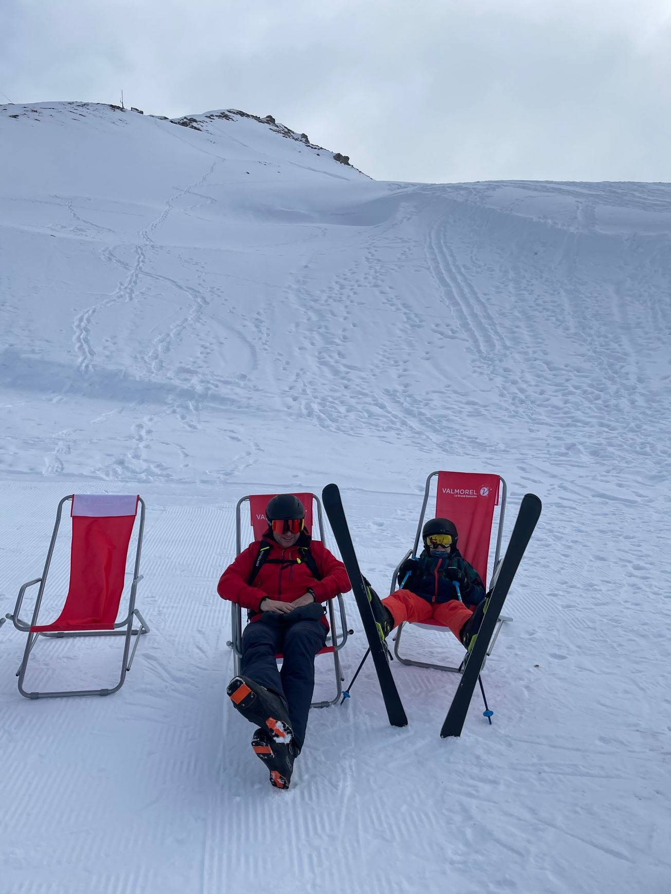

# Stijn Callebaut

<i class="fa-brands fa-linkedin"></i> [stijncallebaut](https://www.linkedin.com/in/stijncallebaut/)
<i class="fa fa-window-maximize"></i> [callebaut.io](https://callebaut.io)
<i class="fa-brands fa-github"></i> [stijnc](https://github.com/stijnc)
<i class="fa-solid fa-book-open"></i> [goodreads](https://www.goodreads.com/user/show/119129422-stijn)

<!--

small overview of sites and links
Living in BXL and loving the vibe of a multicultural city.

-->

---

# My family

<!--

Winter is Skiing season :-) 
Biking, walking, running, the outdoors is great
Kid plays hockey, so we support him as much as we can
and let's not forget lego and reading

-->

---

# @Work

> I drive operational excellence at both professional and managed services.
> I believe openness and inclusiveness are key for organizational and professional growth, and I engage in customers cloud journeys to have direct feedback.

<!--

Stijn drives operational excellence at DexMach services, both professional and managed services. He believes openness and inclusiveness is key for organizational and professional growth.

- Azure expert MS and advanced specs
  - Azure Expert MSP
  - Azure advanced specialization - Windows Server and SQL Server Migration
  - Azure advanced specialization - Linux and Open Source Databases Migration
  - Azure advanced specialization - Kubernetes
  - Azure advanced specialization - Microsoft Windows Virtual Desktop (AVD)
  - Azure advanced specialization - Modernization of Web Applications
  - Azure advanced specialization - Identity and Access Management
  - Azure advanced specialization - Threat Protection
  - Azure advanced specialization - Data and Analytics
- Streamline the hiring process with people growth
- Generate support for new DexMach operational opportunities and services
- Generate support across delivery and technical circles to continuously improve services
- Managing Partner alliances, including Microsoft, Github and Cegeka

-->

